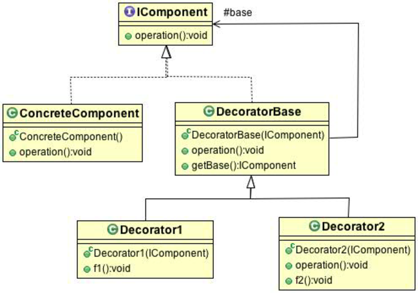
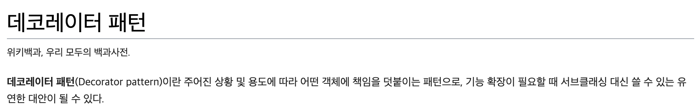

## 데코레이터 패턴 (Decorator Pattern)

### OCP (Open Closed Principle)

가장 중요한 디자인 원칙 중 하나이다. 클래스는 확장에 대해서는 열려 있어야 하지만 코드 변경에 대해서는 닫혀 있어야 한다.

`기존 코드는 건드리지 않은 채로 확장을 통해서 새로운 행동을 간단하게 추가`할 수 있어야 한다. OCP를 따르면 새로운 기능을 추가하는 데 있어서 매우 유연하기 때문에 급변하는 주변 환경에 잘 적응할 수 있으면서도 강하고 튼튼한 디자인을 만들 수 있다.

### 데코레이터 패턴의 정의

데코레이터 패턴에서는 객체에 추가적인 요건을 동적으로 첨가한다. 데코레이터는 서브클래스를 만드는 것을 통해서 기능을 유연하게 확장할 수 있는 방법을 제공한다.

- 데코레이터의 슈퍼클래스는 자신이 장식하고 있는 객체의 슈퍼클래스와 같다.
- 한 객체를 여러 개의 데코레이터로 감쌀 수 있다.
- 데코레이터는 자신이 감싸고 있는 객체와 같은 슈퍼클래스를 가지고 있기 때문에 원래 객체가 들어갈 자리에 데코레이터 객체를 집어넣어도 상관 없다.
- `데코레이터는 자신이 장식하고 있는 객체에게 어떤 행동을 위임하는 것 외에 원하는 추가적인 작업을 수행`할 수 있다.
- 객체는 언제든지 감쌀 수 있기 때문에 실행중(`런타임`)에 필요한 데코레이터를 마음대로 적용할 수 있다.

#### 객체 구성을 이용한 데코레이터 패턴

- 실행중에 데코레이터를 마음대로 조합할 수 있다.
- 데코레이터를 언제든지 새롭게 추가할 수 있다.
- 클라이언트 입장에서는 데코레이터의 존재를 알 수 없다.

### 데코레이터 패턴 단점

- 자잘한 클래스들이 많이 추가된다.
- 구성 요소를 초기화 하는 데 필요한 코드가 복잡해진다. => `팩토리, 빌더로 보완`