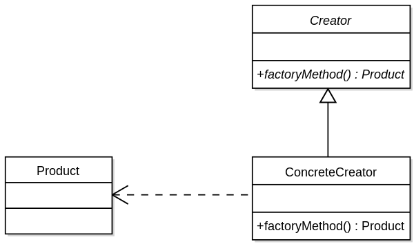
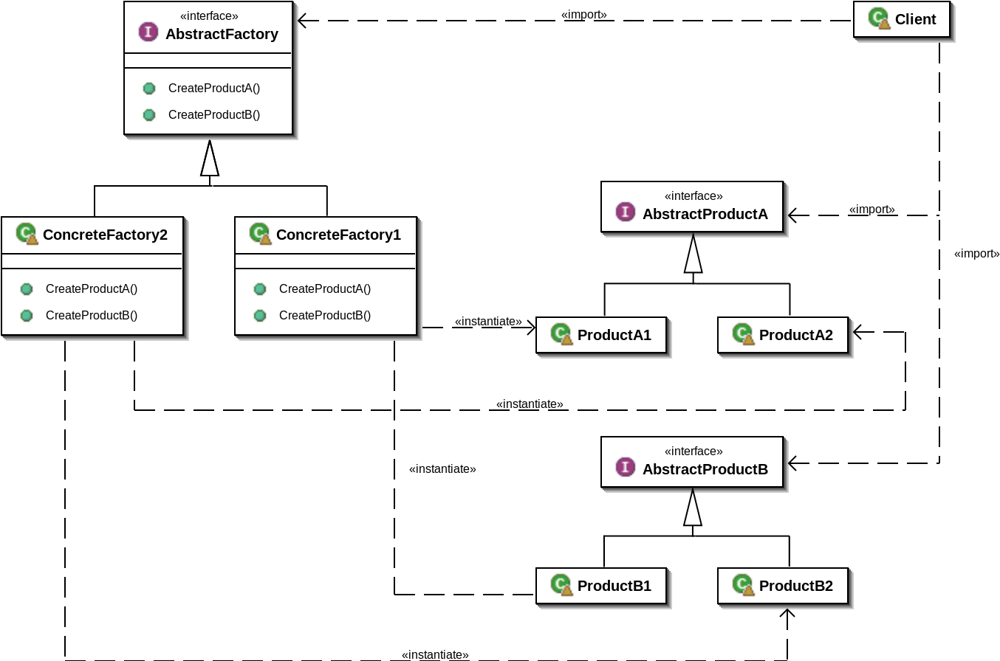

## 팩토리 패턴 (Factory Pattern)

### new 연산자

new를 사용하는 것은 인터페이스가 아닌 특정 구현을 사용하는 것이다. 구현 클래스를 바탕으로 코딩을 하면 나중에 코드를 수정해야 할 가능성이 높이지고, 유연성이 떨어지게 된다.
 
객체를 생성하기 위해 new 연산자의 사용은 불가피하다. 문제를 일으키는 것은 사실 '변화'이다. 인터페이스에 맞춰서 코딩을 하면 변경에 쉽게 대응할 수 있다. 왜냐하면 다형성 덕분에 어떤 클래스든 특정 인터페이스만 구현하면 사용할 수 있기 때문이다.

### 간단한 팩토리

엄밀하게 말하면 간단한 팩토리는 디자인 패턴이 아니다. 간단한 팩토리란 객체 생성부를 가지고 있는 객체이다.

#### 정적 메소드를 이용한 간단한 팩토리

객체를 생성하기 위한 메소드를 실행시키기 위해 객체의 인스턴스를 생성하지 않아도 된다. 하지만 서브 클래스를 만들어서 객체 생성 메소드의 행동을 변경시킬 수 없다는 단점이 있다.

### 팩토리 메소드 패턴

    

팩토리 메소드 패턴에서는 객체를 생성하기 위한 인터페이스를 정의하는데, 어떤 클래스의 인스턴스를 만들지를 서브 클래스에서 결정한다. 여기서 인터페이스란 추상 클래스와 인터페이스 모두를 의미하는 상위 클래스이다.

### 의존 역전 원칙 (DIP)

객체 인스턴스를 직접 만들면 구상 클래스에 의존해야 한다. 구체적인 것이 아니라 추상화된 것이 의존하도록 만들어야 한다. 고수준의 구성요소가 저수준의 구성요소에 의존하면 안 된다.

### 추상 팩토리 패턴

    

서로 연관된 객체들로 이루어진 제품군을 생성하기 위한 디자인 패턴이다. 구현 클래스에 직접 의존하지 않고도 서로 관련된 객체들로 이루어진 제품군을 만들기 위한 용도로 쓰인다.

### 💡정리

- 팩토리를 쓰면 객체 생성을 캡슐화 할 수 있다.
- 팩토리 메소드 패턴에서는 상속을 활용한다. 객체 생성이 서브 클래스에게 위임된다.
- 추상 팩토리 패턴은 객체 구성을 활용한다.
- 모든 팩토리 패턴은 구현 클래스에 대한 의존성을 줄어줌으로써 느슨한 결합을 도와준다.