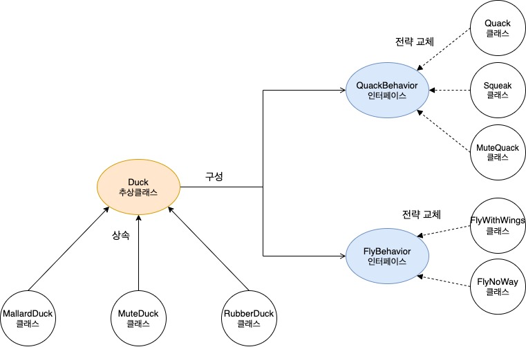
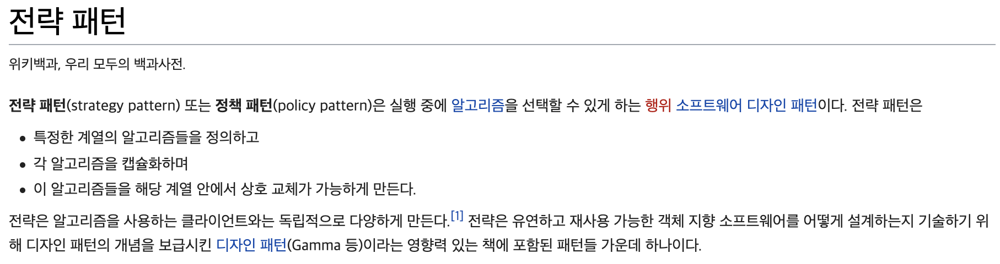

## 전략 패턴 (Strategy Pattern)

**[토비의 스프링]**

자신의 기능 맥락(context)에서 필요에 따라 변경이 필요한 알고리즘(구현 클래스)을 `인터페이스`를 통해 통째로 외부로 분리시키고, 이를 구현한 구체적인 알고리즘을 필요에 따라 바꿔서 사용할 수 있게 하는 디자인 패턴이다.

**[Head First Design Pattern]**

알고리즘 군을 정의하고 각각을 캡슐화 하여 교환해서(전략 대체) 사용할 수 있도록 한다. 전략 패턴을 활용하면 알고리즘을 사용하는 `클라이언트와 독립`적으로 알고리즘을 변경할 수 있다.
 
알고리즘이란 독립적인 책임(객체)로 분리가 가능한 기능을 의미한다.

